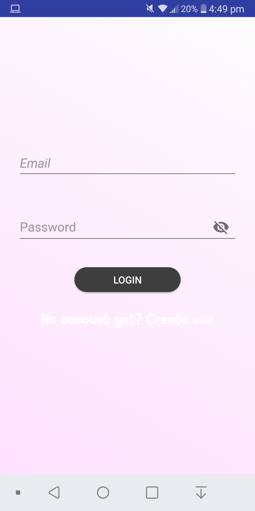
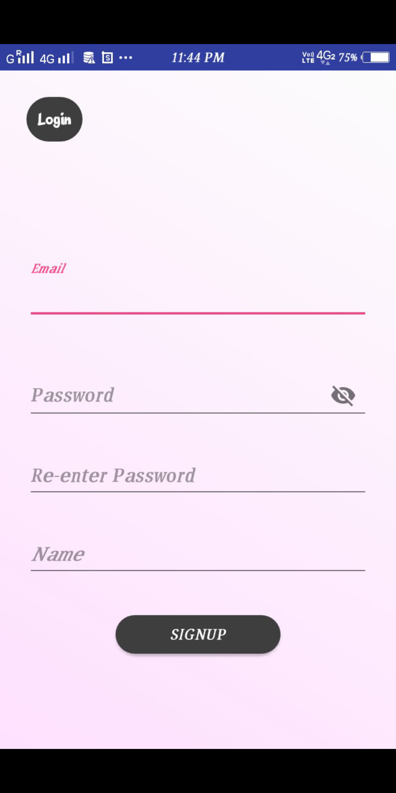
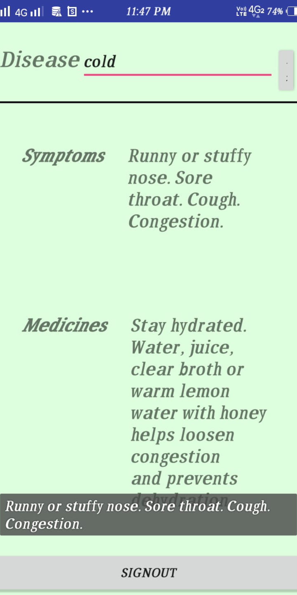

# MEDS-firebase
An android app to get details of diseases and their symptoms using firebase.

* sign in
* sign up 
* getdetails
* admin login-update and edit details
* logout

Using firebase ,authentication ,database and analytics.

</img>
</img>
</img>
